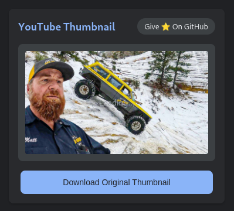

# 🖼️ YouTube Thumbnail Downloader

Ever wanted to grab that perfect YouTube thumbnail without doing a PhD in web inspection? Well, you're in luck! This Chrome extension is here to save your day (and your time)! 

  

## 🎯 What Does It Do?

It does exactly what it says on the tin - downloads YouTube thumbnails! No rocket science, no complicated buttons, just pure thumbnail-grabbing goodness.

- ✨ One-click thumbnail preview
- 📥 Super easy download
- 🌙 Sleek dark mode interface
- 🚀 Lightning fast
- 🎮 Works while you're watching videos

## 🛠️ Installation

Don't worry, it's easier than making instant noodles! 

1. Download this folder (green "Code" button → Download ZIP)
2. Unzip it somewhere on your computer
3. Open Chrome and type `chrome://extensions/` in the address bar (or find Extensions in the menu)
4. Turn on "Developer mode" in the top right (don't worry, you're not actually becoming a developer 😉)
5. Click "Load unpacked" and select the folder you unzipped
6. Boom! 💥 You're done!

## 🎮 How to Use

It's so simple, your cat could do it (if they had opposable thumbs):

1. Go to any YouTube video
2. Click the extension icon in your toolbar
3. See the thumbnail? Click "Download Original Thumbnail"
4. That's it! No step 4! 

## 🤔 Common Questions

**Q: Why isn't it working?**
A: Make sure you're actually on a YouTube video page. The extension can't read your mind... yet.

**Q: The thumbnail looks different from what I see on YouTube**
A: YouTube sometimes uses different thumbnails for different purposes. We grab the highest quality one available!

**Q: Can I use this for other websites?**
A: Nope, this is a YouTube-exclusive party! 🎉

## 🐛 Found a Bug?

If you find something that's not working:
1. Take a deep breath
2. Click that ⭐ on GitHub (it probably won't fix the bug, but it'll make me happy)
3. Open an issue and tell me what's wrong

## 🚀 Pro Tips

- The extension automatically grabs the highest quality thumbnail available
- Dark mode is always on because we're cool like that 😎
- Works with any YouTube video format (normal videos, shorts, etc.)

## 📜 License

WTFPL - Do whatever the f*** you want! Copy it, modify it, sell it, print it and make a paper airplane... I don't care! 🤷‍♂️

---

Made with ☕ and excessive use of emojis by [sh13y](https://github.com/sh13y)

PS: If you found this useful, a ⭐ would make my day! If not, well... still give it a ⭐ 😄 